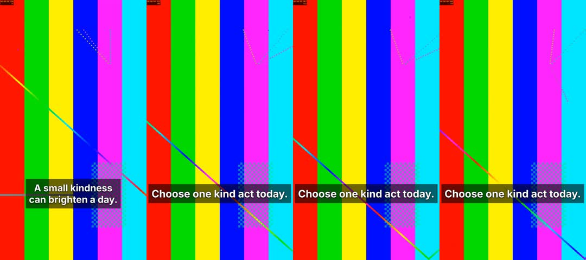

# External-client workflow qualification

This record uses actual Codex CLI 0.150.0-alpha.12.2 with its existing ChatGPT
subscription session and observed `gpt-5.6-sol` model. The portable skill was extracted outside the repository;
the client ran from that isolated directory and connected to actual Next MCP.
The client received a broad creative brief, the shipped skill and fixture
limitations, rather than a sequence of operation instructions.

The final portable ZIP is 28,510 bytes, SHA256
`28a21653e52ef8b45de2ba09c5c1c64672aba20b1bab55fd17f184ac183bfe43`.
Its qualification snapshot matches the integrated feat-547 package byte-for-byte.

## Boundaries

Admin used real canonical services and Postgres, migrations through 0102, in the
task-owned `forge_studio_548_qualification` database. Manager used actual Next
request `after()` behavior. The renderer used actual native namespace and cgroup
containment, independent codec verification and immutable retained output. This
local exported-service launcher is not qualification of a rebuilt sealed image.

The loopback issuer, source delivery, provider response and asset storage were
controlled fixtures. Source footage is a 15-second 1080×1920 test pattern; existing
music and the fake narrator are tones. No paid provider call, production write,
publication, browser session creation or production deployment occurred. Neither
spoken-word accuracy nor natural voice quality can be inferred from these tones.

The local bearer expired during an extended qualification pause. Actual Codex
resume failed with authentication required. The local issuer was rotated with the
same subject, client and read/edit/render/narration/instructions scopes, then the
same conversation resumed. This proves local expired-bearer rejection and
reconnection, not real OAuth consent/refresh.

## Broad brief and diagnosed render failures

Codex created `kindness-today-10s-6433dc84`, a 10-second portrait draft with two
source clips, styled captions, existing music and one existing voice. An initial
source/item duration mismatch was rejected; the client independently corrected
the capture/timeline relationship. Optional `shorts.instructions` was unavailable
because the local Mastra-backed instructional service was not configured. The
portable skill remained available.

The initial narration text was “A small act of kindness can bring hope. Choose
one today.” Canonical admission completed and attached one audio asset. Initial
render failures consumed no extra narration. The client tried an unchanged
render, then used one creative repair removing the clip crossfade, leaving saved
revision 8. It reported that no rendered output or inspection was available and
stopped. The repair was prompted by render failure, not a visible rendered defect;
this distinction remains part of the behavioral evidence.

Exact original-input diagnosis found unbounded intermediate audio codec threads,
a leaked replacement browser after crash recovery, and Chromium surface-copy
failures. Fixes retain all resource limits. The original crossfade composition
then completed in 98.670 seconds; independent verification decoded exactly 300
1080×1920 H.264 frames at 30fps and AAC48kHz stereo. Its MP4 SHA256
`1c9157776bf4fd61e94dff0388c2a22257317e854be8eeb4ea866bf502d55a14`
matched the earlier complete-but-unretained output byte-for-byte. Sampled early,
cut-adjacent and late output pixels retained their captions. Unit regressions
also reproduce the old replacement-browser leak and pass with the fix.

After the service repair, the existing client conversation confirmed revision 8,
no intervening edits, the attached narration and one correction pass remaining.
It requested an unchanged fresh render without another narration call.

## Observed creation and conversation revisions

All three creative workflow handoffs used the same Codex conversation. The human
interleaving was an explicitly labeled synthetic interactive command through
canonical services: it changed only the title to “Kindness — human choice” at
revision 9. It did not create a browser session or impersonate a completed
operator UI action. Codex read its attribution and preserved it in both later
revisions.

| Handoff                             | Revision / exact attempt         | Server evidence preparation | Output ready → observed final handoff |
| ----------------------------------- | -------------------------------- | --------------------------- | ------------------------------------- |
| Initial successful retry            | 8 / `cmudzyor9007g2c94w91wajsl`  | 7.848s                      | 52.260s                               |
| Requested spoken closing correction | 11 / `cmue050zp008a2c946s64ozc2` | 7.151s                      | 34.026s                               |
| Caption-size-only revision          | 12 / `cmue0aonr008o2c9402cwnnem` | 7.681s                      | 37.116s                               |

The added-time clock begins at canonical `outputReadyAt`, excludes rendering,
and ends at the actual client's final handoff event. An independent local trace
observer sampled at 250ms, so its timestamps have up to that much observation
lag. These are local fixture observations, not production latency guarantees.
The initial inspect call took 8.269s as observed at the client versus 7.848s
extraction preparation; its repeated cached call took approximately 0.251s.

Each handoff received eight actual JPEG images and nine text blocks: a report
plus a label for each frame. Sampled frames were 0, 89, 90, 100, 149, 150, 199
and 299, covering representative points and both detected cut boundaries. The
client invoked inspection again to view the cached image evidence, described
readable active captions and reported no detected black frames or authored gaps.
It explicitly declined to claim full-video watching or spoken narration listening.
Its report remained advisory; neither inspection nor narration created approval.

The requested correction changed the closing caption and the second sentence of
the effective speech to “Who could you encourage today?” while retaining the
first sentence, registered voice, music and human title. It used the one
correction pass, leaving two used of two allowed. The visual-only revision changed
closing caption size from 76 to 84 and made no narration-generation call.
Provider counts are reconciled by project/run identity; the separate infrastructure
smoke narration is excluded from the client's authoring cycle.

These original-output samples show the fixed runtime's retained visual content;
they are synthetic source imagery, not evidence of production footage quality.

## Expiry and reuse verification

### Render-attempt timing and conditions

Durable admission-to-terminal intervals include queueing, preparation, rendering,
verification and retention. They are not pure encoding durations; no durable
contained-render start timestamp exists. The separate original-input diagnostic
measured 98.670 seconds for its render child.

| Attempt                                   | Revision | Outcome  | Admission → terminal |
| ----------------------------------------- | -------- | -------- | -------------------- |
| Initial `cmudo8qan`                       | 7        | Failed   | 86.598s              |
| Unchanged retry `cmudoaxbr`               | 7        | Failed   | 308.551s             |
| One automatic creative repair `cmudoidn9` | 8        | Failed   | 81.140s              |
| Successful retry `cmudzyor9`              | 8        | Retained | 106.940s             |
| Spoken correction `cmue050zp`             | 11       | Retained | 115.469s             |
| Visual-only revision `cmue0aonr`          | 12       | Retained | 105.181s             |
| Explicit reuse verification `cmue0js0e`   | 13       | Retained | 119.117s             |

Next development routes had been exercised before admission. Manager and renderer
restarted before the successful revision 8 run and were reused thereafter. Runtime,
browser, codec and local source/HLS/tone fixtures were already cached; these runs
include no real provider or external media-network latency. Every render starts a
fresh contained Node/Chromium process. OS caches were neither flushed nor
controlled, so this is not a controlled cold/warm renderer comparison. Outputs
are ten seconds with two detected cuts and eight inspection samples. Each new
attempt's first inspection was uncached; immediate repeats used immutable cached
evidence. Only the fourth successful run overlapped the bounded image build.

### Capability and narration reuse

A guarded transport probe expired one fixture media capability, observed HTTP403,
refreshed access through actual MCP, downloaded HTTP200 bytes and verified the
same immutable output digest. It saved no live capability URL. The first actual
client recovery read the historical attempt and refreshed access through MCP,
but did not itself establish the expired HTTP response; that narrower observation
is kept separate from the transport probe.

A subsequent explicit client verification admitted a fresh all-reusable narration
run, `cmue0j92300942c943frr5cix`, despite zero passes remaining. The canonical
ledger records `consumesPass:false`; usage remained two of two, with zero provider
calls for that run. Initial and correction runs each consumed one pass. The
fixture provider audit contains exactly three narration dispatches: one separate
infrastructure smoke plus those two client-cycle calls. Reuse preserved the exact
asset version and frozen speech identity; identical tone bytes alone would not
prove correct narration reuse.

Completing the reuse-only run appended identical revision 13. Codex verified its
creative document and narration/music identities were unchanged, then rendered
and inspected that current revision. Its input hash matched revision 12. The final
review identity is project `kindness-today-10s-6433dc84`, revision 13, attempt
`cmue0js0e009e2c94ljcu9mjt`:

[Open the exact local fixture review](http://127.0.0.1:55483/dashboard/shorts/kindness-today-10s-6433dc84?revision=13&renderAttemptId=cmue0js0e009e2c94ljcu9mjt).
This link needs the corresponding local service and authorized interactive access;
no browser approval is claimed.

This fourth qualification probe prepared evidence in 8.350s. Canonical output
readiness was 11:24:08.539Z and the actual Codex rollout records its final answer at
11:25:09.531Z: **60.992s**, approximately one second beyond the one-minute target.
The independent polling observer terminated before this handoff, so this timing
uses the client's own rollout timestamp instead. A separately bounded image build
ran concurrently; no causal explanation for the miss is established. Three of
four observed handoffs met the target; these measurements do not establish a
production latency guarantee.

For the old preview, actual Codex refreshed the historical render capability and
validated its loopback destination and immutable identity. Its direct HTTP
streaming attempt exited with connection error 7 in the read-only client sandbox.
The resulting empty-stream digest is not verification. The final client explicitly
reported that it could not download/hash the refreshed bytes, did not claim to
have watched/listened, and saved no media. This is a limitation of this tested
client configuration, not a claim that every Codex configuration lacks HTTP.
The separate backend expiry probe proves HTTP403 rejection and fresh HTTP200 bytes;
it does not substitute for a successful actual-client download.

Redacted structured identities, timing provenance and the narration ledger are in
[`client-proof.json`](client-proof.json). Private transcripts, capability-bearing
responses, tokens and environment files remain outside the checkout.

## Remaining external qualification

Claude access is unavailable. An authenticated operator browser review, direct
correction and exact-render approval remain unperformed: automatic approval
review rejected the earlier synthetic sign-in action. Separate unauthenticated
fixture browser checks and page-loading measurements are recorded under
`docs/validation/studio-546/README.md`; they do not close this access gap.

Actual Codex creation, rendering, sampled image interpretation, human-edit
preservation, correction and unchanged-audio reuse were observed. Both-client
and authenticated human-approval qualification remain incomplete. Production and
rebuilt-image release requirements remain in `release-checklist.md`.
